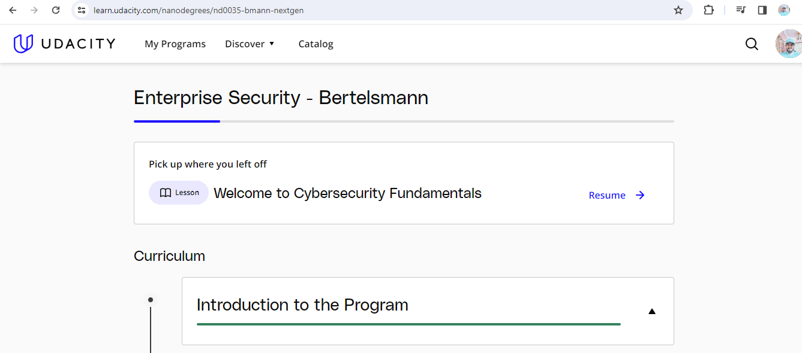
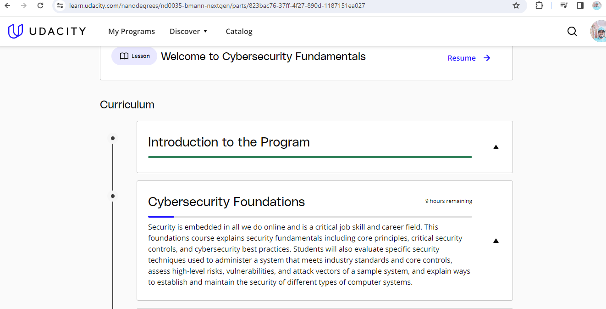
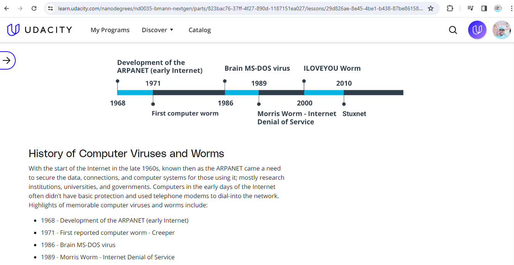
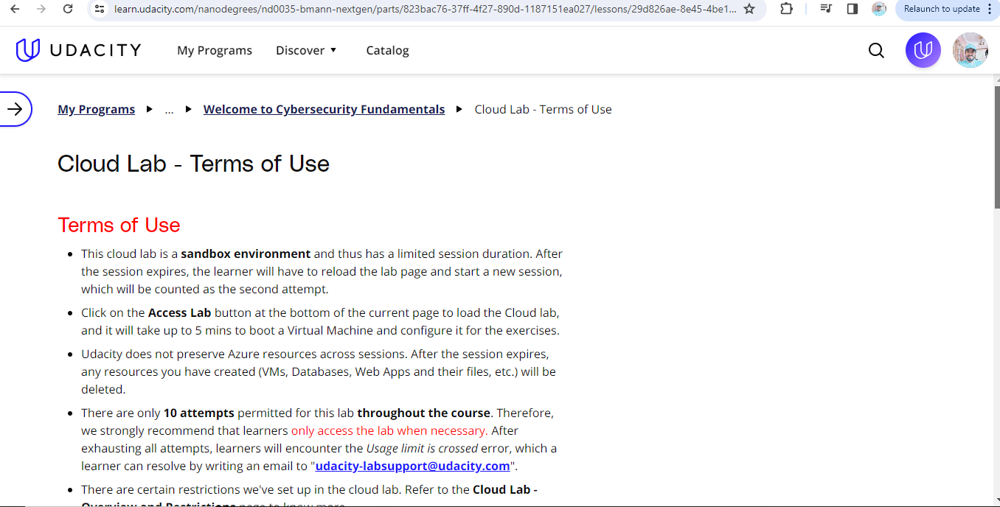

# 2-month-of-enterprise-security-bertelsmann
My pledge "2 months of Udacity" for the Enterprise Security - Bertelsmann Course Nanodegree Program: https://learn.udacity.com/nanodegrees/nd0035-bmann-nextgen The classroom starts from December 14, 2023 and will End in February 15, 2024.  My pledge "#60DaysofUdacity" with Udacity.

My pledge "#60DaysofUdacity" with Udacity.
## Day 1 - Sprint #1: December 18, 2023. #60DaysofUdacity
**The goal of this sprint is to complete all the topics of course Cybersecurity Fundamentals**
- I entered the classroom and watched some videos.
- My current progress is:\
  **Introduction to Program** (Progress 100%)\

## Day 2 - Sprint #1: December 19, 2023. #60DaysofUdacity
**The goal of this sprint is to complete all the topics of course Cybersecurity Fundamentals**
- **What did I work on yesterday?**\
  I learnt about Introduction to Cybersecurity and Cybersecurity and You.
- **What will I work on today?**\
  History of Cybersecurity.
- **What issues are blocking my progress?**\
  None so far

## Day 3 - Sprint #1: December 20, 2023. #60DaysofUdacity
**The goal of this sprint is to complete all the topics of course Cybersecurity Fundamentals**
- **What did I work on yesterday?**\
  I learnt about History of Cybersecurity
- **What will I work on today?**\
  Setup Tools and Evironment.
- **What issues are blocking my progress?**\
  None so far

## Day 4 - Sprint #1: December 21, 2023. #60DaysofUdacity
**The goal of this sprint is to complete all the topics of course Cybersecurity Fundamentals**
- **What did I work on yesterday?**\
  Completed Setup Tools and Evironment.
- **What will I work on today?**\
  Introducing Cloud Labs and will understand Cloud Lab - Terms of Use.
- **What issues are blocking my progress?**\
  None so far

